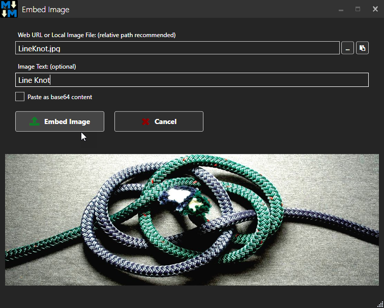

# Markdown Extensions for Confluence Cloud
[create an anchor](#anchors-in-markdown)

## Getting started

```bash
yarn # if you don't have yarn, install with: npm install -g yarn
npm run start
```

!(1_YgtCXuRGmPfPg2PogXVCfQ.png)

```
shell script to make a prod build:
scripts/build.sh
```

```
deploying application to local google app engine dev server:

dev_appserver.py build/app.yaml --enable_host_checking=false
```
## Getting started

```bash
yarn # if you don't have yarn, install with: npm install -g yarn
npm run start
```

!(1_YgtCXuRGmPfPg2PogXVCfQ.png)

```
shell script to make a prod build:
scripts/build.sh
```

```
deploying application to local google app engine dev server:

dev_appserver.py build/app.yaml --enable_host_checking=false
```
## Getting started

```bash
yarn # if you don't have yarn, install with: npm install -g yarn
npm run start
```

!(1_YgtCXuRGmPfPg2PogXVCfQ.png)

```
shell script to make a prod build:
scripts/build.sh
```

```
deploying application to local google app engine dev server:

dev_appserver.py build/app.yaml --enable_host_checking=false
```
## anchors-in-markdown
dsfsdfsdf
sdfsdf
